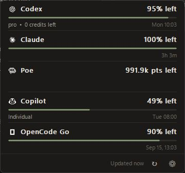

# CodexBar for Windows

- Windows tray app for AI provider usage, balances, and reset times; available for x64 and ARM64.
- **WSL2 is required.** The Windows app runs the original, unchanged [CodexBar CLI](https://github.com/steipete/CodexBar) inside WSL. The matching CLI is included in the downloads; no separate CodexBar CLI installation is required.
- [Download the latest release](https://github.com/hinneslung/CodexBar-for-Windows/releases/latest) · [User guide](docs/windows.md) · [Report an issue](https://github.com/hinneslung/CodexBar-for-Windows/issues)

## For users

### Requirements

- Windows 10/11 on Intel/AMD x64 or ARM64.
- WSL2 with an initialized Linux distribution and a non-root default user. Follow [Microsoft's WSL setup guide](https://learn.microsoft.com/windows/wsl/install).
- Credentials for the providers you enable; available methods differ by provider.

### Install

- Open [Releases](https://github.com/hinneslung/CodexBar-for-Windows/releases/latest):
  - Intel/AMD Windows: download the `windows-x86_64-setup.exe` asset.
  - Windows on ARM: download the `windows-arm64-setup.exe` asset.
  - Portable use: download the matching ZIP, extract the whole folder, and run `CodexBar.exe`.
- Installers include the app, runtime libraries, and WSL CLI. CodexBar Setup does not install WSL for you.
- Downloads are **unsigned**; Windows may show an unknown-publisher or reputation warning. Compare the download with its `.sha256` file before running it.

### First run

1. Open CodexBar from the Start menu or extracted folder, then click its notification-area icon.
2. Open Settings and enable the providers you use. Search the disabled list to find a provider.
3. Open the provider's settings; choose a **WSL distro** or leave it on **Automatic**.
4. Choose a **Credentials** method and follow its instructions. Use **Apply** to save manual values.
5. Refresh to check the result. The source shown after a successful refresh identifies the distro and credential source used.

### Credentials and support

- **Automatic** uses a compatible OpenCode connection when available, otherwise credentials already available to the CLI. It does not sign you in.
- **Provider app/CLI** and **OpenCode** in the provider list describe available automatic sources, not separate manual dropdown choices.
- **API key**, **Browser session**, and **Session token** are manual methods where supported. Extra fields appear only when that provider needs them.
- A saved manual credential takes precedence; a failed manual request does not silently switch to another credential.
- See the [credential methods and provider lists](docs/windows.md#credential-methods), [browser capture instructions](docs/windows.md#browser-sessions), and [troubleshooting](docs/windows.md#troubleshooting).

### Security

- Saved manual credentials are encrypted for your Windows account. Other software running as you may still decrypt them.
- Pasted cURL is parsed, not executed. Manual request configuration is passed temporarily to WSL, not saved as a named plaintext configuration file. See [storage and security](docs/windows.md#storage-and-security).

## For developers

- **Implementation:** native Swift Windows UI; unchanged upstream CLI handles provider requests in WSL. Windows credential fields and source labels come from declarative metadata.
- **Build and test:** [Windows development guide](docs/windows-development.md).
- **Contribute:** create a feature branch and target PRs at `windows-native-app`; `main` mirrors upstream. See [branch and review rules](docs/windows-fork.md#branches-and-pull-requests).
- **Package and release:** [packaging](docs/windows-development.md#packaging) and [release process](docs/windows-fork.md#builds-and-releases).
- **Upstream references:** [CLI](docs/cli.md), [provider implementation](docs/provider.md), and [upstream repository](https://github.com/steipete/CodexBar). These describe upstream behavior, not necessarily Windows GUI support.

## Credits and license

- Based on [CodexBar](https://github.com/steipete/CodexBar) by Peter Steinberger and contributors.
- Upstream cost tracking was inspired by [ccusage](https://github.com/ryoppippi/ccusage).
- [MIT license](LICENSE); upstream attribution is retained.
